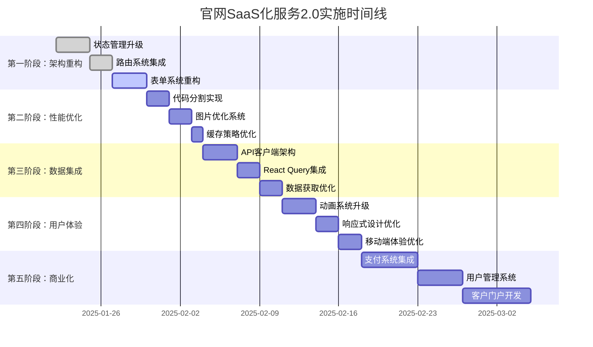

# 官网SaaS化服务2.0实施路线图

## 项目里程碑概览



## 详细实施计划

### 第一阶段：架构重构 (第1-2周)

#### 第1周：基础架构升级

**Day 1-2: 状态管理升级**
```bash
# 安装依赖
npm install zustand @tanstack/react-query

# 创建状态管理文件
mkdir -p src/store
mkdir -p src/hooks
```

**具体任务**:
- [ ] 创建Zustand store配置
- [ ] 迁移现有Context API到Zustand
- [ ] 实现状态持久化
- [ ] 添加状态类型定义

**Day 3-4: 路由系统集成**
```bash
# 安装React Router
npm install react-router-dom

# 创建路由结构
mkdir -p src/pages
mkdir -p src/router
```

**具体任务**:
- [ ] 配置React Router
- [ ] 创建页面组件结构
- [ ] 实现路由守卫
- [ ] 添加404页面处理

**Day 5-7: 表单系统重构**
```bash
# 安装表单相关依赖
npm install react-hook-form @hookform/resolvers yup
```

**具体任务**:
- [ ] 创建表单验证Schema
- [ ] 重构LeadForm组件
- [ ] 实现表单状态管理
- [ ] 添加表单错误处理

#### 第2周：组件架构优化

**Day 8-10: 组件重构**
- [ ] 创建统一组件设计系统
- [ ] 重构现有组件结构
- [ ] 实现组件复用性
- [ ] 添加组件文档

**Day 11-14: 测试和优化**
- [ ] 添加单元测试
- [ ] 性能测试和优化
- [ ] 代码质量检查
- [ ] 文档更新

### 第二阶段：性能优化 (第2-3周)

#### 第3周：代码分割和懒加载

**Day 15-17: 代码分割实现**
```javascript
// vite.config.js 更新
export default defineConfig({
  build: {
    rollupOptions: {
      output: {
        manualChunks: {
          vendor: ['react', 'react-dom'],
          router: ['react-router-dom'],
          forms: ['react-hook-form'],
          ui: ['lucide-react']
        }
      }
    }
  }
})
```

**具体任务**:
- [ ] 配置Vite代码分割
- [ ] 实现组件懒加载
- [ ] 优化bundle大小
- [ ] 添加加载状态

**Day 18-21: 图片和资源优化**
- [ ] 实现图片懒加载
- [ ] 添加图片压缩
- [ ] 优化字体加载
- [ ] 实现资源预加载

### 第三阶段：数据集成 (第3-4周)

#### 第4周：API集成架构

**Day 22-24: API客户端开发**
```javascript
// 创建API客户端
mkdir -p src/api
mkdir -p src/services
```

**具体任务**:
- [ ] 创建API客户端类
- [ ] 实现请求拦截器
- [ ] 添加错误处理
- [ ] 实现重试机制

**Day 25-28: React Query集成**
- [ ] 配置React Query
- [ ] 创建查询Hooks
- [ ] 实现缓存策略
- [ ] 添加数据同步

### 第四阶段：用户体验增强 (第4-5周)

#### 第5周：动画和交互优化

**Day 29-31: 动画系统升级**
```bash
# 安装动画库
npm install framer-motion
```

**具体任务**:
- [ ] 集成Framer Motion
- [ ] 创建动画组件
- [ ] 实现页面转场
- [ ] 优化动画性能

**Day 32-35: 响应式设计优化**
- [ ] 创建响应式Hooks
- [ ] 优化移动端体验
- [ ] 实现触摸交互
- [ ] 添加手势支持

### 第五阶段：商业化功能 (第5-8周)

#### 第6-7周：支付系统集成

**Day 36-42: 支付功能开发**
```bash
# 安装支付相关依赖
npm install @stripe/stripe-js @stripe/react-stripe-js
```

**具体任务**:
- [ ] 集成Stripe支付
- [ ] 创建支付组件
- [ ] 实现订阅管理
- [ ] 添加发票生成

#### 第8周：用户管理系统

**Day 43-49: 用户管理功能**
- [ ] 创建用户管理Hook
- [ ] 实现权限控制
- [ ] 添加用户资料管理
- [ ] 实现会话管理

#### 第9-10周：客户门户开发

**Day 50-63: 客户门户功能**
- [ ] 创建仪表板页面
- [ ] 实现使用情况统计
- [ ] 添加账单管理
- [ ] 实现支持工单

## 技术实施检查清单

### 开发环境准备
- [ ] Node.js 18+ 安装
- [ ] 代码编辑器配置 (VS Code + 扩展)
- [ ] Git配置和分支策略
- [ ] 开发工具配置 (ESLint, Prettier)

### 依赖管理
- [ ] 核心依赖安装
- [ ] 开发依赖配置
- [ ] 版本锁定策略
- [ ] 安全漏洞检查

### 代码质量
- [ ] TypeScript配置
- [ ] ESLint规则配置
- [ ] Prettier格式化
- [ ] Husky Git hooks

### 测试策略
- [ ] 单元测试框架 (Vitest)
- [ ] 组件测试 (Testing Library)
- [ ] E2E测试 (Playwright)
- [ ] 测试覆盖率目标

### 部署配置
- [ ] 构建脚本优化
- [ ] 环境变量配置
- [ ] CDN配置
- [ ] 监控和日志

## 风险控制措施

### 技术风险
1. **兼容性问题**
   - 渐进式升级策略
   - 充分测试覆盖
   - 回滚计划准备

2. **性能影响**
   - 性能基准测试
   - 分阶段部署
   - 实时监控

3. **数据安全**
   - 安全审计
   - 数据加密
   - 访问控制

### 业务风险
1. **用户体验影响**
   - A/B测试验证
   - 用户反馈收集
   - 快速迭代修复

2. **功能完整性**
   - 功能开关控制
   - 灰度发布策略
   - 回滚机制

## 成功指标监控

### 技术指标
- **性能指标**
  - 页面加载时间 < 2秒
  - 首屏渲染时间 < 1.5秒
  - 交互响应时间 < 100ms

- **质量指标**
  - 代码覆盖率 > 80%
  - 错误率 < 0.1%
  - 可用性 > 99.9%

### 业务指标
- **转化指标**
  - 表单转化率提升 30%
  - 支付转化率 > 15%
  - 用户留存率 > 85%

- **用户体验**
  - 客户满意度 > 90%
  - 支持工单减少 50%
  - 用户活跃度提升 40%

## 团队协作规范

### 开发流程
1. **需求分析** → 技术设计 → 代码实现 → 测试验证 → 部署发布
2. **代码审查** → 质量检查 → 性能测试 → 安全扫描
3. **文档更新** → 知识分享 → 经验总结

### 沟通机制
- 每日站会 (15分钟)
- 周度回顾 (1小时)
- 月度规划 (2小时)
- 季度总结 (半天)

### 工具使用
- **项目管理**: Jira/Trello
- **代码管理**: Git + GitHub
- **沟通协作**: Slack/钉钉
- **文档管理**: Notion/Confluence

这个实施路线图提供了详细的时间安排、具体任务和检查清单，确保项目能够按计划顺利推进。

